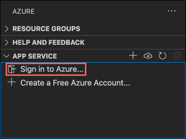
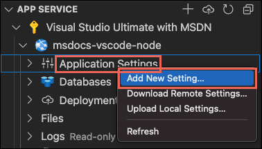

# tie-api-example-twitter

This Node.js connector enables communication between a Teneo bot and Twitter users via Direct Messages and Tweets. The connector uses Twitter's [Account Activity API](https://developer.twitter.com/en/docs/accounts-and-users/subscribe-account-activity/overview) to detect and react to incoming Direct Messages and Tweets, without quickly exhausting Twitter's Rate Limit. This connector is partially based on the [account-activity-dashboard](https://github.com/mkgareja/tbot).

## Prerequisites

### Teneo Engine

Your bot needs to be published and you need to know the Engine URL.

### Twitter account

You will need to apply for a Twitter Developer Account and then create a Twitter App, as described ahead.

### HTTPS

An Azure account with an active subscription is required. [Create an account for free](https://azure.microsoft.com/free/?utm_source=campaign&utm_campaign=vscode-tutorial-app-service-extension&mktingSource=vscode-tutorial-app-service-extension).

To run the connector locally, [ngrok](https://ngrok.com/) is preferred to make the connector available via HTTPS.

## GETTING STARTED

### Create a Twitter app

1. Apply for a Twitter Developer account on [developer.twitter.com](https://developer.twitter.com/en/apps), select "Making a Bot", and fill in all required fields. On the Specifics section, set "Will your app use Tweet, Retweet, like, follow, or Direct Message functionality?" to YES. You may set all other options to No. Continue filling in required descriptions and validate Twitter's activation email.

2. Create a Twitter App [here](https://developer.twitter.com/en/apps/create). Fill all required fields and tap "Create"

### Create a Twitter Account Activity API

In the Account Activity API/Sandbox section, click [Setup Dev Environment](https://developer.twitter.com/en/account/environments). Link this new environment to the App you created in the previous step and take note of the `environment_label` for later use.

### Configure the Twitter App

1. Open your app's [Details](https://developer.twitter.com/en/apps)
2. Navigate into Permissions > Edit > Access permission section > Enable Read, Write and direct messages.
3. On the Keys and Tokens tab > click Create button. Take note of all four keys and tokens.

## Connector Setup Instructions

There are some ways of running this connector are described ahead.
You can run the connector online with Azure.
You can [Run the connector locally](#running-the-connector-locally) or deploying it on a server of your choice. This is preferred if you're familiar with Node.js development and want to have a closer look at the code, or to implement modifications and enhancements.

### Running the connector with Azure

# Install with Visual Studio Code

- Have [Visual Studio Code](https://code.visualstudio.com/) installed.
- The [Azure App Service extension](https://marketplace.visualstudio.com/items?itemName=ms-azuretools.vscode-azureappservice) for Visual Studio Code.
 <!-- - <a href="https://git-scm.com/" target="_blank">Install Git</a> -->
- In Visual Studio Code, in the [Activity Bar](https://code.visualstudio.com/docs/getstarted/userinterface), select the **Azure** logo.
- In the **App Service** explorer, select **Sign in to Azure...** and follow the instructions.

    In Visual Studio Code, you should see your Azure email address in the Status Bar and your subscription in the **AZURE APP SERVICE** explorer.

    

#### Configure the App Service app and deploy code

1. Select your application folder.

# Deploy to Linux

2. Right-click on App Services and select **Create new Web App**. A Linux container is used by default.
1. Type a globally unique name for your web app and press **Enter**. The name must be unique across all of Azure and use only alphanumeric characters ('A-Z', 'a-z', and '0-9') and hyphens ('-').
1. In Select a runtime stack, select the Node.js version you want. An **LTS** version is recommended.
1. In Select a pricing tier, select **Free (F1)** and wait for the resources to be provisioned in Azure.
1. In the popup **Always deploy the workspace "myApp" to \<app-name>"**, select **Yes**. This way, as long as you're in the same workspace, Visual Studio Code deploys to the same App Service app each time.

    While Visual Studio Code provisions the Azure resources and deploys the code, it shows [progress notifications](https://code.visualstudio.com/api/references/extension-guidelines#notifications).

# Deploy to Windows

2. Right-click on App Services and select **Create new Web App... Advanced**.
1. Type a globally unique name for your web app and press **Enter**. The name must be unique across all of Azure and use only alphanumeric characters ('A-Z', 'a-z', and '0-9') and hyphens ('-').
1. Select **Create a new resource group**, then enter a name for the resource group, such as *AppServiceQS-rg*.
1. Select the Node.js version you want. An **LTS** version is recommended.
1. Select **Windows** for the operating system.
1. Select the location you want to serve your app from. For example, *West Europe*.
1. Select **Create new App Service plan**, then enter a name for the plan (such as *AppServiceQS-plan*), then select **F1 Free** for the pricing tier.
1. For **Select an Application Insights resource for your app**, select **Skip for now** and wait the resources to be provisioned in Azure.
1. In the popup **Always deploy the workspace "myApp" to \<app-name>"**, select **Yes**. This way, as long as you're in the same workspace, Visual Studio Code deploys to the same App Service app each time.

    While Visual Studio Code provisions the Azure resources and deploys the code, it shows [progress notifications](https://code.visualstudio.com/api/references/extension-guidelines#notifications).

    > [!NOTE]
    > When deployment completes, your Azure app doesn't run yet because your project root doesn't have a *web.config*. Follow the remaining steps to generate it automatically. For more information, see [You do not have permission to view this directory or page](configure-language-nodejs.md#you-do-not-have-permission-to-view-this-directory-or-page).

1. In the **App Service** explorer in Visual Studio code, expand the node for the new app, right-click **Application Settings**, and select **Add New Setting**:

    

1. Enter `SCM_DO_BUILD_DURING_DEPLOYMENT` for the setting key.
1. Enter `true` for the setting value.

    This app setting enables build automation at deploy time, which automatically detects the start script and generates the *web.config* with it.

1. In the **App Service** explorer, select the **Deploy to Web App** icon again, confirm by clicking **Deploy** again.

1. Revisit your [https://developer.twitter.com/en/apps](Details), click 'Edit', and use `webhook_url` to form the following URL values and add them as whitelisted Callback URLs:

    ``` bash
    https://yoururl.azurewebsites.net/webhook/twitter
    https://yoururl.azurewebsites.net/callbacks/addsub
    https://yoururl.azurewebsites.net/callbacks/removesub
    ```

-----

## Running the connector locally

Next, we need to make the connector available via https. We'll use [ngrok](https://ngrok.com) for this.

1. Start ngrok. The connector runs on port 5000 by default, so we need to start ngrok like this:

    ``` bash
    ngrok http 5000
    ```

2. Running the command above will display a public forwarding https URL. Copy it, we will use it as a `webhook_url` in the final step below.

3. Revisit your [https://developer.twitter.com/en/apps](Details), click 'Edit', and use `webhook_url` to form the following URL values and add them as whitelisted Callback URLs:

    ``` bash
    https://yoururl.ngrok.io/webhook/twitter
    https://yoururl.ngrok.io/callbacks/addsub
    https://yoururl.ngrok.io/callbacks/removesub
    ```

#### Setup & run a Node.js web app

1. Clone this repository:

    ``` bash
    git clone https://github.com/artificialsolutions/tie-api-example-twitter.git
    ```

2. Install Node.js dependencies:

    ``` bash
    npm install
    ```

3. Create a new file called `.env` based on `.env.sample` and fill in your Twitter keys, tokens, Teneo Engine URL and webhook environment name. Twitter keys and access tokens are found on your app page on [apps.twitter.com](https://apps.twitter.com/).

4. Run locally:

    ```bash
    npm start
    ```

*Note for Mac Users you might get

 ``` bash
 uncaught exception: listen EADDRINUSE: address already in use :::5000
Error: listen EADDRINUSE: address already in use :::5000
```

Airplay is using port 5000 you can deactivate it in System Preferences › Sharing and uncheck  ```AirPlay  Receiver``` to release port 5000. ([source](https://nono.ma/port-5000-used-by-control-center-in-macos-controlce))

That's it! You can now interact with your Teneo solution powered bot with Direct Messages, Tweet mentions, and Tweet replies.

## Production considerations

This app is for demonstration purposes only. The application can handle light usage, but you may experience API rate limit issues under heavier load. Consider storing data locally in a secure database, caching requests, or applying for a business account for increased Rate Limits.
